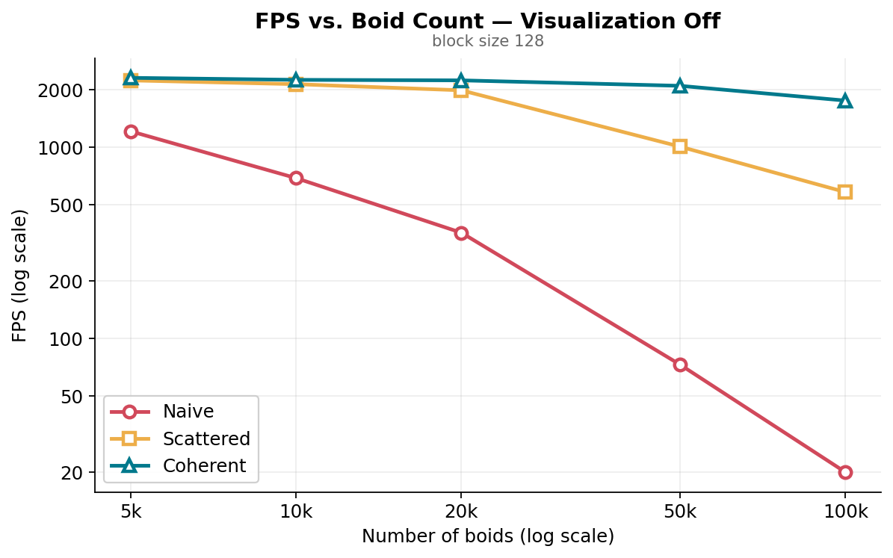
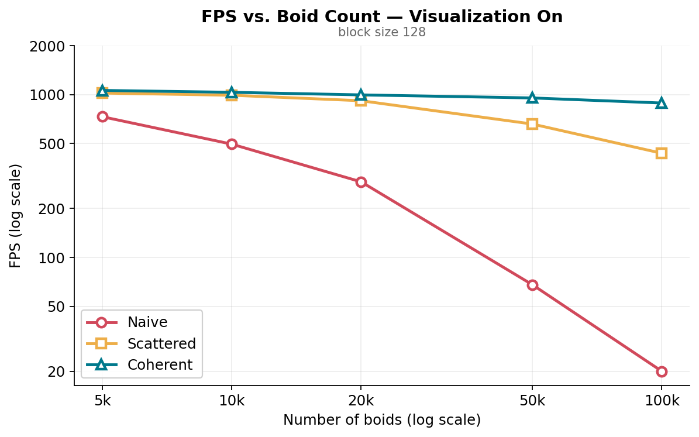
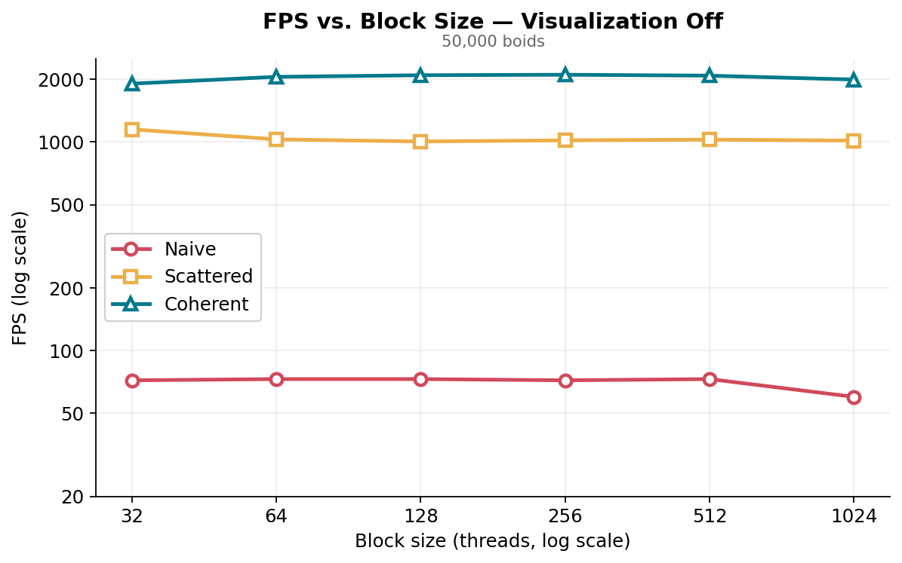
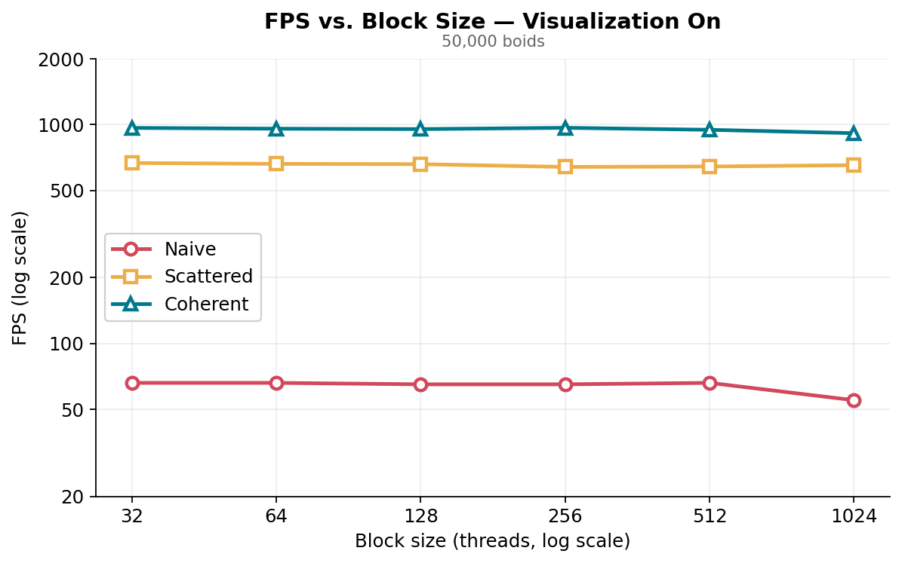
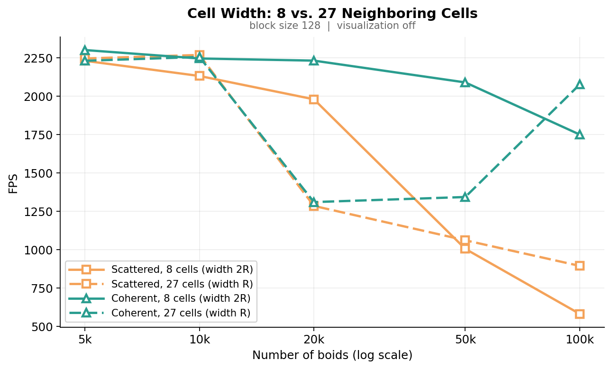

**University of Pennsylvania, CIS 5650: GPU Programming and Architecture,
Project 1 - Flocking**

* Author: Xuan Zhu
   * [LinkedIn](https://www.linkedin.com/in/xuan-zhu-4ba736220)
* Tested on: Windows 11, AMD Ryzen AI 7 350, 32GB DDR5, NVIDIA GeForce RTX 5070 Laptop GPU (Personal computer)

## Output result

### GIFs

<table>
<tr>
<td align="center"><b>5000 Boids (Start)</b></td>
<td align="center"><b>5000 Boids (End)</b></td>
</tr>

<tr>
<td align="center">

</td>

<td align="center">

</td>
</tr>

<tr>
<td align="center"><b>50000 Boids</b></td>
<td align="center"><b>100000 Boids</b></td>
</tr>

<tr>
<td align="center">

</td>

<td align="center">

</td>
</tr>

</table>

## Implemented

This project implements a parallelized Boids flocking simulation using CUDA and OpenGL.
The simulation models realistic flocking behavior (cohesion, separation, and alignment) for
up to 100,000 boids in 3D space.
Three implementations are included for performance comparison:
 
* Naive O(N²) neighbor search
* Scattered uniform grid
* Coherent uniform grid
The naive version has every boid check every other boid, applying the three Reynolds rules
with per-rule neighborhood distances and a speed clamp.
The scattered uniform grid labels each boid with a cell index, sorts the boids by cell with
`thrust::sort_by_key`, and recovers per-cell start/end offsets by comparing adjacent entries
in parallel; neighbor search then walks the candidate cells and dereferences
`dev_particleArrayIndices` to reach the position and velocity data.
The coherent uniform grid adds a `kernReshuffleData` pass that rewrites positions and
velocities into sorted order, so the velocity kernel indexes `dev_posSorted` and
`dev_velSorted` directly and the pointer indirection disappears entirely.
 
**Grid-looping optimization.** Neither grid kernel hard-codes a search of 8 or 27 cells.
Both derive the axis-aligned bounding box of the search sphere from `thisPos ± maxDist`,
convert it to clamped cell coordinates, and loop over exactly that range in z → y → x order
to match `gridIndex3Dto1D`. The search therefore adapts to any cell width for free, visits
strictly fewer cells whenever a boid sits near a cell center, and never touches cells
outside the domain.
 
The project highlights how spatial data structures and GPU memory access patterns
dramatically improve performance, scaling from a few thousand to a hundred thousand boids in
real time.

## Performance Analysis

### Methodology
* Runtime environment: CUDA implementation compiled in Release mode, VSync disabled.

* Measurement: Framerates (FPS) recorded after ~20 s runtime. Values are estimates due to natural runtime variation.
---
## Result

### Framerate vs. Number of Boids
 
Without visualization (block size = 128):
 
| # of boids | Naive | Scattered uniform grid | Coherent uniform grid |
|---|---|---|---|
| 5,000 (default) | 1210 | 2232 | 2302 |
| 10,000 | 689 | 2133 | 2247 |
| 20,000 | 357 | 1981 | 2233 |
| 50,000 | 73 | 1006 | 2091 |
| 100,000 | 20 | 582 | 1751 |
 

With visualization (block size = 128):
 
| # of boids | Naive | Scattered uniform grid | Coherent uniform grid |
|---|---|---|---|
| 5,000 (default) | 731 | 1021 | 1060 |
| 10,000 | 496 | 990 | 1032 |
| 20,000 | 291 | 916 | 995 |
| 50,000 | 68 | 659 | 953 |
| 100,000 | 20 | 436 | 887 |
 

 
### Framerate vs. Block Size
 
Without visualization (N = 50,000):
 
| Block size | Naive | Scattered uniform grid | Coherent uniform grid |
|---|---|---|---|
| 32 | 72 | 1150 | 1905 |
| 64 | 73 | 1030 | 2054 |
| 128 | 73 | 1006 | 2091 |
| 256 | 72 | 1019 | 2102 |
| 512 | 73 | 1027 | 2081 |
| 1024 | 60 | 1016 | 1993 |
 

 
With visualization (N = 50,000):
 
| Block size | Naive | Scattered uniform grid | Coherent uniform grid |
|---|---|---|---|
| 32 | 66 | 667 | 965 |
| 64 | 66 | 661 | 957 |
| 128 | 65 | 659 | 953 |
| 256 | 65 | 640 | 966 |
| 512 | 66 | 643 | 946 |
| 1024 | 55 | 652 | 913 |
 

 
### Cell Width: 8 vs. 27 Neighboring Cells
 
Without visualization (block size = 128). Width 2R searches 8 cells, width R searches 27:
 
| # of boids | Scattered, 8 cells | Scattered, 27 cells | Coherent, 8 cells | Coherent, 27 cells |
|---|---|---|---|---|
| 5,000 | 2232 | 2247 | 2302 | 2232 |
| 10,000 | 2133 | 2270 | 2247 | 2257 |
| 20,000 | 1981 | 1286 | 2233 | 1311 |
| 50,000 | 1006 | 1062 | 2091 | 1344 |
| 100,000 | 582 | 895 | 1751 | 2078 |
 

 
---

## Related Questions & Insights
 
### 1) Effect of boid count on performance
 
**Naive — O(N²)**
 
* Trend: collapses almost immediately once the GPU saturates.
* Data (no-viz): 1210 → 357 → 20 FPS at 5k → 20k → 100k.
* Why: the work is N² distance checks against a fixed machine throughput. A 20× increase in
  N costs 60× in framerate, and the only reason it is not the full 400× is that at 5k boids
  the GPU was underutilized to begin with.
**Scattered uniform grid — O(N log N + N·k)**
 
* Trend: nearly flat to 20k, then a real decline.
* Data (no-viz): 2232 → 1981 → 582 FPS at 5k → 20k → 100k.
* Why: each boid only inspects a fixed search volume, so per-boid work tracks local
  *density* rather than N. The domain is fixed, so density rises linearly with N — the
  scaling is still superlinear, but with a constant factor smaller by the ratio of search
  volume to domain volume.
**Coherent uniform grid — same asymptotics, far better locality**
 
* Trend: flattest of the three; the gap over scattered opens up exactly where the cells get
  crowded.
* Data (no-viz): 2302 → 2233 → 1751 FPS at 5k → 20k → 100k.
* Why: identical algorithmic work to the scattered version, but the inner loop streams
  contiguous memory instead of chasing pointers (see question 3).
At 5k boids coherent is only ~3% ahead of scattered, since neither is bandwidth-bound yet.
At 50k it is 2.1× ahead, and at 100k it is 3.0× ahead. Against naive at 100k, both grid
methods are 29–88× faster.
 
Visualization applies a roughly constant per-frame cost, which flattens the top of the
chart: nothing exceeds ~1060 FPS with rendering on, and at low boid counts the grid
implementations are limited by the draw call and VBO copy rather than by the simulation.
The naive numbers barely move (20 FPS at 100k either way), which confirms the rendering
overhead is negligible next to an N² kernel.

 ---
 
### 2) Effect of block size / block count on performance
 
Block size sweep (N = 50,000, no-viz):
 
* Naive: flat at 72–73 across 32–512, then drops to 60 at 1024.
* Scattered: best at 32 (1150), settling to a plateau of ~1006–1030 from 64 upward.
* Coherent: 1905 at 32, peaking at 2102 around 128–256, easing back to 1993 at 1024.
The overall picture is that block size barely matters, which is expected: warps are the unit
of scheduling, and none of these kernels uses shared memory or `__syncthreads()`, so the
grouping of warps into blocks changes nothing about how they cooperate. With 50k boids there
are always far more blocks than SMs, so the machine stays fed at every setting tested.
 
The deviations at the two ends are more interesting than the plateau:
 
* **1024 threads is uniformly worse**, and worst for naive (−18%). Blocks are assigned to an
  SM atomically, so a 1024-thread block quantizes occupancy coarsely — if register pressure
  allows only one resident block, a large slice of the SM's thread capacity is stranded. The
  naive kernel is hit hardest because its long inner loop depends most on having many
  resident warps to hide global-memory latency.
* **Scattered prefers the smallest block (32).** Its neighbor loop issues scattered,
  uncoalesced loads, so it benefits from the finest possible scheduling granularity — more
  independent blocks means more opportunities to swap in a warp whose memory request has
  landed. Coherent shows the opposite preference, climbing to a peak at 256, because its
  loads are already coalesced and it gains more from the larger blocks' better
  instruction-level throughput than it loses to occupancy quantization.
With visualization enabled the entire sweep collapses to ~946–966 FPS for coherent, because
the render path, not the block configuration, sets the frame time.

 ---
 
### 3) Did the coherent grid improve performance?
 
* Observation: coherent beats scattered at every boid count tested, and the margin grows
  sharply with N — 2302 vs 2232 FPS at 5k (+3%), 2091 vs 1006 at 50k (+108%), 1751 vs 582 at
  100k (+201%).
* Expectation: an improvement was anticipated. What surprised me was the magnitude, given
  that the coherent version does strictly *more* work per frame — `kernReshuffleData` is an
  extra kernel launch that rewrites both the position and velocity arrays every step.
* Why it wins anyway: the cost added is linear in N and perfectly coalesced, while the cost
  removed is superlinear and scattered. In the scattered kernel the inner loop reads
  `particleArrayIndices[m]` and then `pos[b]`; consecutive `m` yield boid ids in arbitrary
  order because the sort permuted them, so a warp issues 32 addresses spread across the
  entire position array and pulls 32 mostly-wasted cache lines. Reordering the boid data
  itself turns that into `pos[m]` for consecutive `m`, which a handful of contiguous cache
  lines can serve for the whole warp. It also removes one level of dependent indirection —
  a serialized round trip to memory before every position load.
* Why the gap grows: both effects scale with how many boids the inner loop actually visits.
  At 5k the loops are short and the kernel is launch- and latency-bound, so there is nothing
  to coalesce; by 100k the loops dominate the frame and the kernel is squarely
  bandwidth-bound.

 ---
  
### 4) Effect of cell width and 8 vs. 27 neighboring cells
 
The instinct that 27 cells must lose to 8 because it visits more cells is wrong, and the
volume arithmetic shows why. For uniform density ρ:
 
* `W = 2R`, 8 cells → candidates ∝ (2 · 2R)³ = **64ρR³**
* `W = R`, 27 cells → candidates ∝ (3 · R)³ = **27ρR³**
The coarse grid produces about **2.4× more candidate boids** despite touching a third as
many cells. The neighborhood sphere it needs is only (4/3)πR³ ≈ 4.2R³ either way, so almost
all of that extra volume is boids that get fetched and then immediately rejected by the
distance test.
 
That predicts a crossover, and the data shows one. At 100k boids the fine grid wins
decisively — 895 vs 582 FPS scattered, 2078 vs 1751 coherent — because cells are dense and
the cost is dominated by the inner loop over candidates, where volume is everything. At 5k
and 10k the two configurations are within noise of each other: cells are mostly empty or
hold one or two boids, so the cost shifts to per-cell overhead — computing `gridIndex3Dto1D`
and the two dependent loads of the start/end arrays that must return before the kernel even
knows whether there is work. Twenty-seven of those beats eight, and the fine grid also
allocates 8× as many cells, making the start/end arrays larger and less cache-friendly.
 
Grid looping softens both ends, since it visits only the cells the search sphere actually
overlaps rather than a fixed 8 or 27, but it does not change which regime dominates.
 
**Caveat on the 20k–50k points.** Both 27-cell curves dip hard at 20k (1286 and 1311 FPS)
and the coherent one recovers to 2078 by 100k, which is non-monotonic and not explained by
anything above — cell width does not change the simulation itself, so FPS at a given N
should be well-behaved. I suspect a sampling artifact: framerate depends on how far the
flock had clustered when the reading was taken, and clustering raises local density
substantially. Re-measuring with CUDA events averaged over a fixed step count from a fixed
seed would settle it, and is the obvious next step.
 
 ---
## Extra Credit

### Grid-looping optimization
 
It is worth being precise about this, because the intuitive pitch — "it searches fewer
cells than the hard-coded version" — is mostly false in the interior of the domain.
 
Put the grid in units of the cell width `w` and consider one axis. The search interval is
`[p − R, p + R]`, length `2R`. The number of cells it spans is
`floor((p+R)/w) − floor((p−R)/w) + 1`, which for `w = 2R` evaluates to 2 for every boid
position except the measure-zero case of a boid at the exact cell center, and for `w = R`
evaluates to 3 everywhere. So grid looping visits 8 and 27 cells respectively — the same
counts the hard-coded version uses. There is no free lunch in the interior.
 
The real wins are elsewhere:
 
* **Boundary clamping.** With the default parameters (`scene_scale = 100`, `maxDist = 5`,
  `w = 2R = 10`) the grid is 20³ = 8000 cells, and the outer shell accounts for
  20³ − 18³ = 2168 of them, or 27%. Every boid in that shell has 4 of its 8 cells outside
  the domain (12 of 27 at the faces, more at edges and corners), and grid looping drops
  them by shrinking the loop bounds rather than testing and rejecting them one at a time.
* **Cell width becomes free to tune.** This is the big one. A hard-coded search bakes the
  width into the code; the loop-bound version made the entire 8-vs-27 experiment a
  one-line change, and that experiment found a 1.5× speedup for the scattered grid at 100k
  boids (582 → 895 FPS).
* **Correctness with no special cases.** Choosing *which* 8 cells to check requires
  branching on which octant of its cell the boid occupies. Deriving the bounds from the
  bounding box removes that logic and the class of off-by-one bugs that comes with it.
The generalization is also worth stating, since it explains question 4 more cleanly than
the 8-vs-27 framing does. For arbitrary width `w`, the search spans `2R/w + 1` cells per
axis, so the volume examined is `(2R/w + 1)³ · w³ = (2R + w)³` — independent of how the
grid is indexed, and strictly decreasing as `w` shrinks toward the ideal `8R³` bounding
cube. Meanwhile the number of cell headers to fetch grows as `(2R/w + 1)³`. Those are the
two terms in tension:
 
| Cell width | Volume searched | Cells visited |
|---|---|---|
| `2R` | 64R³ | 8 |
| `R` | 27R³ | 27 |
| `2R/3` | ~19R³ | 64 |
| → 0 | → 8R³ | → ∞ |
 
The crossover observed at high boid counts is exactly the point where the shrinking volume
term stops paying for the growing header term. Which width wins is a property of boid
density, not of the number 8 or 27, and grid looping is what makes that knob reachable
without touching the kernel.
 
The cost is warp divergence: threads in a warp now have data-dependent loop trip counts,
so a boid at a corner and a boid in the interior no longer march in lockstep. In practice
this is minor — the divergence only affects the 27% of cells in the boundary shell, and the
work it skips is real work, not padding — but it is a genuine trade against the uniform
trip count of the hard-coded version.
